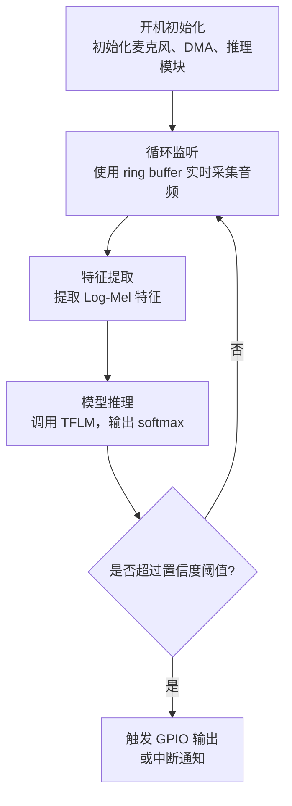

# 概要设计（Architecture Design）

## 1 系统架构概述

​	该系统以 STM32F746ZGT6 MCU 为核心，结合音频采集、语音特征提取、关键词识别模型推理及控制输出功能，形成端侧语音交互闭环系统。整体架构分为五个主要模块：

​	（1）音频采集模块

​	（2）特征提取模块（Log-Mel）

​	（3）模型推理模块（TFLM）

​	（4）控制输出模块（GPIO/事件）

​	（5）系统调度与中断处理模块

## 2 系统开发流程图（PC 与 MCU 协同视角）

.png)

​	该关键词识别系统的开发流程可划分为三个阶段，分别在 PC 端与嵌入式 MCU 端协同进行：

（1）**数据处理阶段（PC 端）**：采集语音 → 提取 Log-Mel 特征 → 数据打包保存（供模型训练使用）

（2）**模型训练与导出阶段（PC 端）**：使用提取特征在 PC 上训练 CNN 模型，评估精度后导出为 `.tflite` 量化模型

（3）**模型部署阶段（MCU 端）**：加载量化模型至 MCU Flash，使用 TFLite Micro 引擎进行实时推理与响应

## 3 模块功能划分

### 3.1 数据处理模块

（1） 音频采集方案：

（2） 特征提取方式：

| 技术     | 说明                                             | 选型理由                           |
| -------- | ------------------------------------------------ | ---------------------------------- |
| Log-Mel  | Mel 滤波器后对能量谱取对数                       | TFLM 默认支持，推理快，RAM 占用低  |
| 处理库   | `librosa`（训练端） / `micro_features`（部署端） | 与 TFLite Micro 默认兼容，便于移植 |
| 特征维度 | `[49 × 10]`                                      | 在精度与 MCU 内存之间取得平衡      |

### 3.2 模型构建与训练

（1）模型结构设计

（2）模型优化与量化

| 格式      | 工具                      | 选型理由                       |
| --------- | ------------------------- | ------------------------------ |
| `.tflite` | TensorFlow Lite Converter | 官方推荐格式，支持量化部署     |
| `.cc`数组 | `xxd -i` 转换             | 嵌入式平台可直接编译进固件     |
| 量化策略  | INT8 全量化               | 减少模型体积，适配 STM32 Flash |

（3）训练平台与框架

| 阶段     | 平台               | 工具链 / 依赖                |
| -------- | ------------------ | ---------------------------- |
| 训练     | Win/Linux + Python | TensorFlow + librosa + numpy |
| 导出模型 | 同上               | TFLite Converter             |
| 部署测试 | STM32F7            | CMake / CubeIDE + arm-gcc    |
| 推理运行 | MCU 裸机           | TFLM + CMSIS DSP/NNS 支持    |

### 3.3 嵌入式部署模块

| 工具/框架             | 说明                          | 选型理由                            |
| --------------------- | ----------------------------- | ----------------------------------- |
| TensorFlow 2.14       | 模型构建与训练                | 与 TFLite Micro 版本兼容性良好      |
| TensorFlow Lite Micro | MCU端推理框架                 | 轻量、跨平台、支持裸机部署          |
| CMSIS-DSP / CMSIS-NN  | 特征处理 + 卷积优化库         | ARM 官方提供，适配 STM32 内核       |
| CMake                 | 构建系统                      | 跨平台可移植性强，适用于 STM32 工程 |
| STM32CubeMX           | 外设初始化与 HAL 驱动生成工具 | 快速生成 DFSDM / I2S / UART 等配置  |

## 4 系统内存与资源分配

| 类型       | 内容                           | 占用估算     |
| ---------- | ------------------------------ | ------------ |
| RAM        | 输入张量 + 中间张量 + 缓冲     | ≈ 180~200 KB |
| Flash      | 模型参数 + TFLM runtime + 代码 | ≈ 400~450 KB |
| Stack/Heap | 系统缓冲、变量空间             | ≈ 30~40 KB   |

## 5 MCU 推理流程与接口说明

