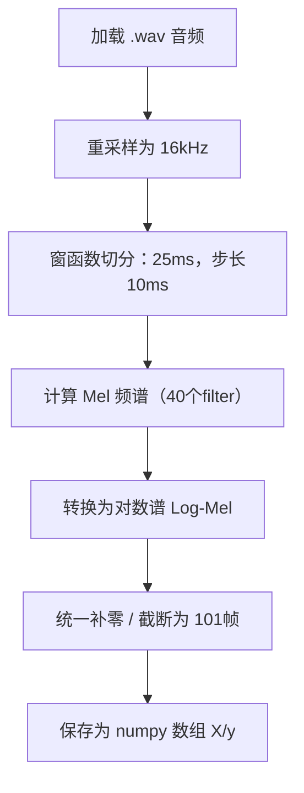

# 代码详细设计

## 代码架构目录

```
TinyML_Keyword/
├── training/
│   ├── data/
│   │   ├── speech_commands/         # 原始数据（链接）
│   │   ├── preprocessed/            # 生成的 X.npy, y.npy
│   │   └── prepare_dataset.py       # Log-Mel 特征提取脚本
│   ├── model_training/
│   │   ├── model.py                 # 模型结构定义
│   │   ├── train_model.py           # 模型训练脚本
│   │   └── evaluate_model.py        # 模型评估
│   ├── export_model/
│   │   ├── export_tflite.py         # TFLite 导出
│   │   └── convert_to_c_array.py    # 可选导出为 .cc
│   ├── utils/
│   │   └── config.py                # 全局路径
├── deployment/
│   ├── src/
│   ├── include/
│   └── CMakeLists.txt
├── docs/
│   ├── 01产品需求文档.md
│   └── 02产品概要设计.md
├── README.md
└── requirements.txt
```

## 1 数据处理阶段

### 1.1 音频采集模块


### 1.2 特征提取模块

（1）模块目标

将原始 WAV 音频转换为统一尺寸的 Log-Mel 特征图，供模型训练使用。

（2）输入输出说明

| 名称     | 类型           | 说明                      |
| -------- | -------------- | ------------------------- |
| 输入音频 | `.wav`         | 采样率 16kHz，1 秒内      |
| 输出特征 | `X.npy`        | shape = (样本数, 40, 101) |
| 标签     | `y.npy`        | 标签索引（int32）         |
| 标签集   | `commands.txt` | 所有类别名称              |

（3）代码流程



（4）关键参数

| 参数       | 数值       | 说明                             |
| ---------- | ---------- | -------------------------------- |
| 采样率     | 16,000 Hz  | 与 MCU 端保持一致                |
| 窗长       | 25 ms      | win_length = 400                 |
| 步长       | 10 ms      | hop_length = 160                 |
| FFT 大小   | 512        | 对应频率分辨率                   |
| Mel 滤波器 | 40         | 提取低维特征（默认）             |
| 时序长度   | 101        | 固定帧长，用于模型输入维度一致性 |
| Fmin/Fmax  | 20~4000 Hz | 语音常用频段                     |

（5）所用库和工具

librosa：音频加载、频谱计算、Mel 滤波器组

tqdm：进度可视化

## 2 模型构建与训练阶段

### 2.1 模型构建模块

（1）模型结构设计

| 层序号 | 层类型    | 参数设置                                            |
| ------ | --------- | --------------------------------------------------- |
| 1      | Conv2D    | filters=16, kernel=(3×3), stride=1, padding='valid' |
| 2      | MaxPool2D | pool_size=2×2                                       |
| 3      | Conv2D    | filters=32, kernel=(3×3)                            |
| 4      | MaxPool2D | pool_size=2×2                                       |
| 5      | Flatten   |                                                     |
| 6      | Dense     | units=64                                            |
| 7      | Dense     | units=12（类别数）                                  |

（2）模型推理结构过程表

| 层序号 | 层类型          | 参数设置                                          | 输出尺寸 (H × W × C) | 参数量估算             | 中间张量占用（float32） |
| ------ | --------------- | ------------------------------------------------- | -------------------- | ---------------------- | ----------------------- |
| 0      | 输入            | `input_shape=(40, 101, 1)`                        | 40 × 101 × 1         | -                      | ≈ 16 KB（≈40×101×4B）   |
| 1      | Conv2D          | filters=16, kernel=3×3, stride=1, padding='valid' | 38 × 99 × 16         | (3×3×1)×16 +16 = 160   | ≈ 240 KB（38×99×16×4B） |
| 2      | MaxPool2D       | pool_size=2×2                                     | 19 × 49 × 16         | 0                      | ≈ 59 KB                 |
| 3      | Conv2D          | filters=32, kernel=3×3                            | 17 × 47 × 32         | (3×3×16)×32 +32 = 4640 | ≈ 102 KB                |
| 4      | MaxPool2D       | pool_size=2×2                                     | 8 × 23 × 32          | 0                      | ≈ 29 KB                 |
| 5      | Flatten         | -                                                 | 5888                 | 0                      | ≈ 23 KB                 |
| 6      | Dense           | units=64                                          | 64                   | 5888×64 + 64 = 376576  | ≈ 256 B                 |
| 7      | Dense（输出层） | units=12（关键词类别）                            | 12                   | 64×12 + 12 = 780       | ≈ 48 B                  |

