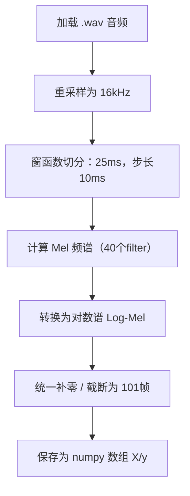

# 代码详细设计

## 代码架构目录

TinyML_Keyword/
├── training/
│   ├── data/
│   │   ├── speech_commands/      # 原始数据（或链接）
│   │   ├── preprocessed/         # 生成的 X.npy, y.npy
│   │   └── prepare_dataset.py    # 预处理脚本（Log-Mel）
│   ├── model_training/
│   │   ├── model.py              # 模型结构定义
│   │   ├── train_model.py        # 模型训练主脚本
│   │   └── evaluate_model.py     # 模型评估/测试
│   ├── export_model/
│   │   ├── export_tflite.py      # 导出 .tflite + 量化
│   │   └── convert_to_c_array.py # （可选）导出为 .cc 文件
│   └── utils/
│       └── config.py             # 全局路径 / label_map
│
├── deployment/
│   ├── src/
│   ├── include/
│   └── CMakeLists.txt
│
├── docs/
│   ├── 01产品需求文档（Product Specification）.md           # 产品需求文档
│   └── 02产品概要设计（Architecture Design）.md     # 概要设计文档
│
├── README.md
└── requirements.txt             # PC 环境依赖

## 1 数据处理阶段

### 1.1 音频采集模块
采用tensorflow提供音频集

### 1.2 特征提取模块

（1）模块目标

将原始 WAV 音频转换为统一尺寸的 Log-Mel 特征图，供模型训练使用。

（2）输入输出说明

| 名称     | 类型           | 说明                      |
| -------- | -------------- | ------------------------- |
| 输入音频 | `.wav`         | 采样率 16kHz，1 秒内      |
| 输出特征 | `X.npy`        | shape = (样本数, 40, 101) |
| 标签     | `y.npy`        | 标签索引（int32）         |
| 标签集   | `commands.txt` | 所有类别名称              |

（3）代码流程

（4）关键参数

| 参数       | 数值       | 说明                             |
| ---------- | ---------- | -------------------------------- |
| 采样率     | 16,000 Hz  | 与 MCU 端保持一致                |
| 窗长       | 25 ms      | win_length = 400                 |
| 步长       | 10 ms      | hop_length = 160                 |
| FFT 大小   | 512        | 对应频率分辨率                   |
| Mel 滤波器 | 40         | 提取低维特征（默认）             |
| 时序长度   | 101        | 固定帧长，用于模型输入维度一致性 |
| Fmin/Fmax  | 20~4000 Hz | 语音常用频段                     |

（5）所用库和工具

librosa：音频加载、频谱计算、Mel 滤波器组

tqdm：进度可视化

## 2 模型构建与训练阶段

### 2.1 

