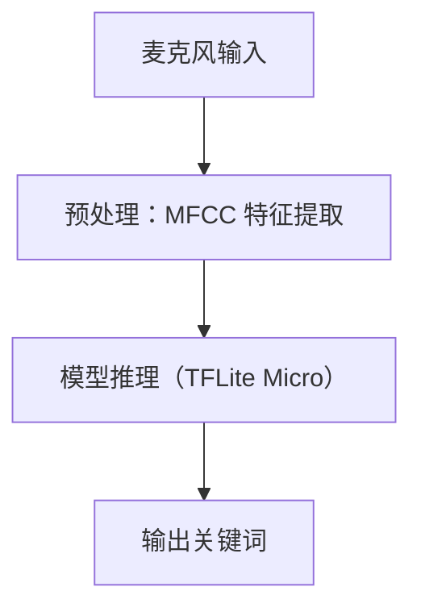
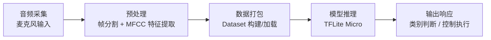

# TinyML 第六章关键词识别项目（Keyword Spotting Project - Chapter 6）

# 1 概要设计

## 1.1 项目概述（Overview）

​        本项目基于《TinyML》第六章关键词识别内容，构建一个可运行于微控制器（如 Arduino Nano 33 BLE）上的轻量化语音识别系统。该系统能够识别如 “yes”、“no”、“unknown” 等关键词，适用于离线唤醒与语音命令控制。

## 1.2 系统框架图 （System Architecture）



## 1.3 模块划分（Modules）

.png)

### 1.3.1 数据处理 （Data Processing）

1 音频数据采集

​	下载或者录制原始音频数据

2 数据预处理

（1）分帧： 将连续音频分成若干短时间段（帧）

（2）加窗：为每一帧加权，降低边缘效应，减少频谱泄漏

（3）MFCC提取： 快速傅里叶变换（FFT）将时域信号转换为频域表示，FFT 提供每一帧的频谱能量分布

​				Mel 滤波器组，模拟人耳听觉特性：低频分辨率高，高频模糊，将线性频谱投影到 Mel 频率轴（非线性），使用 20~40 				个 Mel 滤波器（三角窗），每个滤波器输出一个能量值，构成 Mel 能量谱

​				对数运算（Log Power），模拟人耳对响度的感知：对数感知

​				离散余弦变换（DCT），将 Mel 能量谱压缩成倒谱系数（去冗余）

（4）归一化：

​	Zero-mean：整体减去均值

​	Unit-variance：除以标准差

3 数据加载封装

​	构建训练集、验证集、测试集，用于TensorFlow Dataset

输出格式说明：[49帧 × 10维]

​	49 表示帧数（时间维度），每帧间隔约 20ms → 覆盖约 1 秒音频

​	10 是 MFCC 的维度（可选 10~13）

​	可 reshape 为 `[49, 10, 1]` 以适应 CNN 模型


### 1.3.2 模型训练和转换（Model Training & Conversion）

1 模型训练（Model Traning）

（1）模型结构设计

​	CNN卷积网络，更高识别率，适合二维特征输入

（2）模型输入/输出格式

​	输入维度：[49帧， 10维]

​	输出维度：对应关键词类别数，[yes, no, unknown, silence,,,,,,,]

（3）训练参数

（4）保存模型

2 模型转换 (Conversion)

（1）目的

​	将 `.h5` 模型转为 `.tflite`，便于部署到边缘设备

​	为嵌入式系统再进一步转为 `.cc` 数组文件，供 C/C++ 直接引用

（2）转换流程

（3）转为.cc文件

### 1.3.3 嵌入式部署

​	本模块负责将 `.tflite` 模型部署到资源受限的微控制器（STM32F746ZGT6）上，完成端侧关键词识别任务的实时推理。

（1）部署目标与要求

| 项目       | 描述                          |
| ---------- | ----------------------------- |
| MCU 平台   | 32 位STM32F746ZGT6            |
| 运行库     | TensorFlow Lite Micro（TFLM） |
| 可用资源   | RAM：320kb Flash：1MB         |
| 实时性要求 | 推理延迟 < 200ms              |
| 离线部署   | 不依赖网络连接，完全本地处理  |

（2）构建与部署方式

构建系统：

​	使用CMake + STM32CubeMX + arm-none-eabi-gcc`

工具链：

| 工具                          | 版本说明                  |
| ----------------------------- | ------------------------- |
| GCC 工具链                    | `arm-none-eabi-gcc 10.x+` |
| STM32CubeMX                   | 生成外设初始化代码        |
| STM32CubeIDE / VSCode + CMake | 工程管理与调试            |
| CMSIS-DSP                     | 用于加速 MFCC / 矩阵运算  |
| CMSIS-NN（可选）              | 加速 INT8 卷积            |


## 1.4 数据流说明 （Data Flow Description）

本章节用于说明关键词识别系统中**各处理模块之间的数据流转关系**，包括数据格式、处理路径、接口转换等内容

### 1.4.1 系统级数据流流程图



### 1.4.2  数据流阶段分解

1 音频采集阶段

（1）**采样源**：麦克风（I2S / ADC / DFSDM）

（2）**数据格式**：16kHz、16bit PCM、单通道

（3）**缓存格式**：1 秒缓冲区（16000 点）缓存至 RAM 中

2 特征提取阶段（预处理）

（1）操作：分帧、加窗、FFT、Mel 滤波、DCT、归一化

（2）输出：49帧 × 10维 MFCC 特征矩阵

3 数据加载阶段（训练中）

（1）封装为 TensorFlow Dataset

（2）含标签：类别 one-hot 编码（如 [0, 1, 0, 0]` 表示“no”）

4 模型推理阶段（部署时）

（1）输入：1帧 MFCC 特征（int8/float）

（2）执行：TFLite Micro 解释器推理

（3）输出：softmax 概率向量

5 输出控制阶段

（1）判断最大得分类 argmax(scores)`

（2）执行动作（串口打印、LED、蜂鸣器、蓝牙通信等）

总结：

| 模块     | 输入             | 输出                   | 描述            |
| -------- | ---------------- | ---------------------- | --------------- |
| 音频采集 | 原始声音         | PCM波形数组            | 采样速率为16kHz |
| 特征提取 | PCM波形          | MFCC特征矩阵 `[49×10]` | 预处理阶段输出  |
| 模型推理 | 特征矩阵（量化） | 概率向量 `[N类]`       | 模型预测阶段    |
| 输出判断 | softmax结果      | 类别索引 / 控制信号    | 终端响应逻辑    |

## 1.5 运行平台与环境要求 （Target Platforms & Dependencies）

| 阶段     | 平台               | 工具链 / 依赖                |
| -------- | ------------------ | ---------------------------- |
| 训练     | Win/Linux + Python | TensorFlow + librosa + numpy |
| 导出模型 | 同上               | TFLite Converter             |
| 部署测试 | STM32F7            | CMake / CubeIDE + arm-gcc    |
| 推理运行 | MCU 裸机           | TFLM + CMSIS DSP/NNS 支持    |

## 1.6 主要技术选型 （Tech Stack & Design Decisions）

本项目基于 TinyML 场景对性能、资源占用、可部署性等维度进行权衡，以下是各核心模块的技术选型与决策理由。

### 1.6.1 音频采集方案

本章节采用"http://download.tensorflow.org/data/speech_commands_v0.02.tar.gz"该链接提供文件

### 1.6.2 特征提取方式

| 技术     | 说明                                             | 选型理由                                       |
| -------- | ------------------------------------------------ | ---------------------------------------------- |
| MFCC     | Mel-Frequency Cepstral Coefficients              | 主流语音特征提取方案，体积小、精度高、计算高效 |
| 处理库   | `librosa`（训练端） / `micro_features`（部署端） | 与 TFLite Micro 默认兼容，便于移植             |
| 特征维度 | `[49 × 10]`                                      | 在精度与 MCU 内存之间取得平衡                  |

### 1.6.3 模型结构

| 模型        | 特点                    | 选型理由                           |
| ----------- | ----------------------- | ---------------------------------- |
| Dense (MLP) | 结构简单，占用资源少    | 可快速测试部署流程，适用于极小模型 |
| CNN         | 支持时频建模，识别率高  | 适合资源允许时的主力模型结构       |
| DS-CNN      | Depthwise Separable CNN | TFLM 推荐结构，资源利用率优        |

### 1.6.4 模型格式与优化

| 格式      | 工具                      | 选型理由                       |
| --------- | ------------------------- | ------------------------------ |
| `.tflite` | TensorFlow Lite Converter | 官方推荐格式，支持量化部署     |
| `.cc`数组 | `xxd -i` 转换             | 嵌入式平台可直接编译进固件     |
| 量化策略  | INT8 全量化               | 减少模型体积，适配 STM32 Flash |

### 1.6.5 运行框架与部署工具

| 工具/框架             | 说明                          | 选型理由                            |
| --------------------- | ----------------------------- | ----------------------------------- |
| TensorFlow 2.14       | 模型构建与训练                | 与 TFLite Micro 版本兼容性良好      |
| TensorFlow Lite Micro | MCU端推理框架                 | 轻量、跨平台、支持裸机部署          |
| CMSIS-DSP / CMSIS-NN  | 特征处理 + 卷积优化库         | ARM 官方提供，适配 STM32 内核       |
| CMake                 | 构建系统                      | 跨平台可移植性强，适用于 STM32 工程 |
| STM32CubeMX           | 外设初始化与 HAL 驱动生成工具 | 快速生成 DFSDM / I2S / UART 等配置  |

### 1.6.6 部署平台选型理由：STM32F746ZGT6

| 项目     | 说明                                   |
| -------- | -------------------------------------- |
| 主频     | 216MHz Cortex-M7                       |
| RAM      | 320KB，满足 TFLM 推理所需              |
| Flash    | 1MB，可容纳多个量化模型                |
| 支持外设 | DFSDM、I2S、UART 等语音系统必需接口    |
| 市场应用 | 在语音、边缘识别等嵌入式项目中广泛使用 |

## 1.7项目目录结构 （Folder Structure）

```text
tinyml_keyword_ch6/
├── training/                  # 训练与模型导出模块
│   ├── model_training/        # 模型结构定义与训练脚本
│   ├── utils/                 # 数据加载与特征提取工具
│   ├── scripts/               # TFLite/CC 模型转换工具
│   ├── exported_model/        # 导出的模型文件（.h5 / .tflite / .cc）
│
├── deployment/                # 嵌入式推理部署模块（适配 STM32）
│   ├── src/                   # 核心代码
│   │   ├── main_functions.cc  # 推理入口函数
│   │   ├── output_handler.cc  # 推理结果处理（串口 / LED）
│   │   ├── audio_provider.cc  # 音频采集与接口封装
│   │   └── model.cc           # TFLite 模型数组（自动拷贝）
│   ├── CMakeLists.txt         # 构建配置（支持 CubeIDE / CLI）
│   └── platform_config/       # HAL 初始化 / BSP 支持
│
├── docs/                      # 文档与说明
│   ├── README.md
│   └── 设计说明.md
└── LICENSE / .gitignore       # 项目通用文件
```

